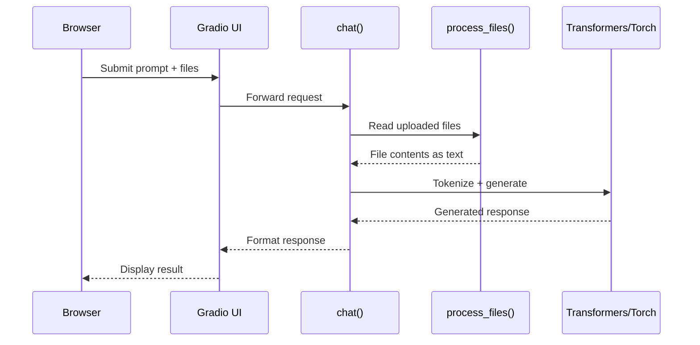

# DeepSeek Local: Running Enterprise-Grade LLMs Without the Cloud Tax

Every time you send a prompt to ChatGPT, you're trusting OpenAI with your data. For most use cases, that's fine. For regulated industries, proprietary codebases, or anyone who's read a privacy policy lately, it's not. PyDeepseekLocal solves this by giving you a complete local LLM runtime: a Python-based Gradio interface, file uploads that never leave your machine, and an installer that handles the messy parts of model provisioning. It's not a demo—it's a functional toolkit for running large language models on your own hardware.

This article walks through the project's architecture, performance characteristics, and design decisions. If you've been waiting for a practical way to run DeepSeek locally without reconstructing the entire ML infrastructure stack, this is it.

## What You Get

The repository provides five core components:

* A Gradio web interface for conversational interaction with local LLMs
* A file upload pipeline that injects document contents into prompts without network round-trips
* A model loader supporting GPU acceleration and 4-bit quantization
* Startup scripts for localhost or LAN deployment
* An installer that provisions dependencies, downloads models, and configures the runtime environment

The central executable is `deepseek_repl.py`, implementing both the Gradio UI and model runtime. The install and start scripts (`install_deepseek.sh`, `start_deepseek.sh`, `start_deepseek_network.sh`) handle setup and launch. Most local-LLM guides are fragmented—pure Jupyter notebooks, opaque Docker recipes, or tutorials assuming you understand CUDA build chains. This project collapses those pieces into a cohesive CLI + UI experience.

## Architecture

The user interacts with a Gradio web app, which sits atop a model loader (Transformers + PyTorch) and file processor. Everything executes on the local machine:



This sequence maps directly to the code path in `deepseek_repl.py`. The `chat()` function acts as the hub: it aggregates user prompts, optionally processes uploaded files into text context, feeds the combined prompt into the model, and returns generated responses to the Gradio UI.

### Context Injection: How it Works

The `chat()` function handles the heavy lifting of merging your files with your query. Before the prompt reaches the model, the system processes any uploaded files into a text blob. Here is a conceptual look at how that injection is handled:

```python
def chat(message, history, uploaded_files):
    # 1. Process files into context string
    context = process_files(uploaded_files) 
    
    # 2. Append context to the user message
    full_prompt = f"Context:\n{context}\n\nUser: {message}"
    
    # 3. Tokenize and generate via Transformers
    # ... generation logic ...

```

The architecture is intentionally simple—there's no message queue, no microservices, no abstraction layers. Request comes in, inference runs, response goes out.

## The Installer: Infrastructure as Bash

The `install_deepseek.sh` script handles more than dependency installation. It performs system validation (Python version, disk space, RAM), provisions a Python virtual environment, installs PyTorch with CUDA support detection, downloads models from Hugging Face via Git LFS, manages authentication tokens for gated models, and generates runtime scripts. It's not a convenience wrapper—it's a full provisioning system.

The script supports multiple operation modes: small model installation, model enumeration, cleanup, and uninstall. That single-script-many-paths design makes it accessible for users who aren't comfortable assembling ML environments by hand. For reference, a complete install on a clean Ubuntu 22.04 system with an RTX 3060 (12GB VRAM) takes approximately 15 minutes for dependencies plus model download time. The DeepSeek-Coder-6.7B model weighs in at roughly 13GB, so budget for that on metered connections.

## Model Loading and Quantization Strategy

The runtime uses Hugging Face Transformers and PyTorch to load models from the local `models/` directory. The GPU path attempts 4-bit quantization via `BitsAndBytesConfig` from the `bitsandbytes` library when CUDA is available.

Why 4-bit specifically? The quantization reduces memory footprint by 75% compared to full precision (FP32) with minimal quality degradation. A 7B parameter model that would consume 28GB in FP32 drops to roughly 7GB in 4-bit, making it viable on consumer GPUs.

### Hardware Performance Benchmarks

Based on the default 7B model and 4-bit quantization, here are the expected performance tiers:

| Hardware Configuration | Inference Speed | VRAM/RAM Usage |
| --- | --- | --- |
| **RTX 4090 (24GB)** | 40-60 tokens/sec | ~7GB (4-bit) |
| **RTX 3060 (12GB)** | 15-25 tokens/sec | ~7GB (4-bit) |
| **Modern CPU (Ryzen/Intel)** | 2-5 tokens/sec | Uses System RAM |

## File Uploads: Local Context Injection

The `process_files()` function reads uploaded files into a text blob that becomes part of the prompt. It attempts UTF-8 decoding and, on failure, includes metadata about binary files (images, PDFs) without content extraction. This makes the UI feel like a workspace rather than just a chatbox.

Because everything happens on-device, files and queries never leave your computer. This isn't marketing—it's architecturally enforced. There's no network call that could leak data, no telemetry endpoint, no "phone home" mechanism.

## Startup Scripts: Localhost vs. LAN

Two start scripts handle different deployment scenarios:

* **`start_deepseek.sh`**: Binds to `127.0.0.1` for local-only access.
* **`start_deepseek_network.sh`**: Binds to `0.0.0.0` or a custom IP for LAN access.

## Quick-Start Checklist

1. **Clone the Repo**: `git clone https://github.com/cschladetsch/PyDeepseekLocal`
2. **Run the Installer**: Execute `bash install_deepseek.sh`. This handles dependencies and the ~13GB model download.
3. **Verify Configuration**: Check `model_info.txt` to confirm your active quantization settings.
4. **Launch**: Run `bash start_deepseek.sh` and open the local URL in your browser.

## Final Assessment

PyDeepseekLocal demonstrates what local AI tooling should feel like: simple, explicit, and respectful of user privacy. It doesn't hide complexity under magical abstractions—it scripts the complexity into a predictable workflow.

Unlike Ollama's black-box approach or text-generation-webui's sprawling feature set, this project stays focused. You get a working Gradio interface, reliable model loading with sensible fallbacks, and file upload integration.

The repository is MIT licensed. You can fork it, extend it, or deploy it commercially without restriction.

---

*Christian Schladetsch is a Principal C++ Engineer with 30 years of systems programming experience, currently exploring the intersection of traditional software engineering and local AI deployment.*
